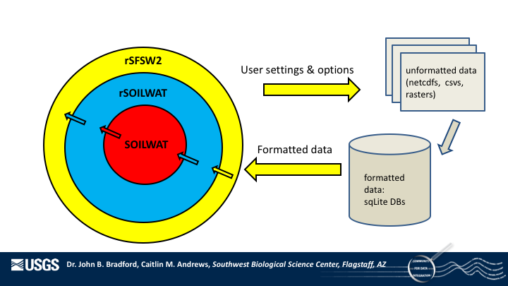

# Structure, Workflow, and Standards of the Dryland Ecology Laboratory GitHub Organization

Authors:  Daniel Schlaepfer & Caitlin Andrews
------

This is the Dryland Ecology Laboratory's guide to the structure, workflow, and standards of the Dryland Ecology Laboratory GitHub Organization. The Dryland Ecology Laboratory GitHub Organization consists of many different repositories, each with a different code base and utility aimed at promoting our ability to model ecohydrology.

This document is provided to orient developers to the purpose and relationships between our repositories as well as clearly explain our expectations in (A) using Git and GitHub and (B) developing code, including unit testing and documentation. These are our broad standards that apply to all of our repositories and the languages we develop in (C, C++, R, make). We rely on many other styles guides, software, etc. to assist in our workflow. This document provides expectation on what tools to use, but not specifics, as that is covered thoroughly by the creators of these tools.

More information on repository specific code development, testing (both informal and formal), and installation can be found in the README.md document of each repository.

## Table of Contents

[Repositories of the Dryland Ecology GitHub Organization](#theRepos)
  * [Relationships between Repositories](#repoRelations)
  * [SOILWAT2](#soilwat)
  * [rSOILWAT2](#rsoilwat)
  * [rSFSW2](#rsfsw)
  * [STEPWAT2](#stepwat)
  * [rSFSTEP2](#rsfstep)
  * [rSFSW2_tools](#sfsw_tools)
  * [Additional Repositories](#addrepos)

[Git and GitHub](#gits)
  * [Interacting with Git](#interacting)
  * [Developing Code with Git](#gitdevelop)
  * [GitHub Organization and Management Features](#gitorg)
  * [GitHub Code Quality Features](#gitqual)

[Developing Code](#develop)

  * [Hierarchy of Testing](#testheir)

  * [R Code Standards](#rinfo)
    * [Style Guide](#rstyle)
    * [Code Development](#rdevel)
    * [Documentation](#rdoc)
    * [Unit Testing](#rtest)

  * [C Code Standards](#cinfo)
    * [Style Guide](#cstyle)
    * [Code Development](#cdevel)
    * [Documentation](#cdoc)
    * [Unit Testing](#ctest)

[Useful Links](#links)

[Downloads](#dls)

## Repositories of the Dryland Ecology GitHub Organization <a name="theRepos"/>

### Relationships between Repositories <a name="repoRelations"/>

SOILWAT2 runs on a site by site basis. While the simulations of water balance are fast, running SOILWAT2 stand-alone is inefficient, as it needs to read and write information from disk about each site individually. Furthermore, running simulations for many sites is cumbersome from the user perspective, as a series of site-specific input files (.in) need to be formatted for each site. Because of these issues, the R Soilwat Wrapper (rSFSW2) and the R Soilwat Package (rSOILWAT2) were developed. These repositories allow users to set-up information for multiple sites simultaneously and for the efficient handling of these sites' information in R.

rSOILWAT2 is a R package with a set of functions whose primary purposes are to translate information from R to C and to execute a SOILWAT2 simulation with this information. Data about a site is first formatted into a S4 object and then translated to C classes. rSFSW2 relies on rSOILWAT2 functionality to pass information, site by site, to SOILWAT2. Additionally, rSOILWAT2 avoids disk operations and most things happen in memory, reducing run time.

rSFSW2 is designed to gather user's options and information about sites. All site-specific inputs and treatments in a project are read in at once via a series of _.csvs_. The information within these .csvs is then parsed up on a site by-site basis, processed, and then sent to SOILWAT2 via the functions in rSOILWAT2. Outputs from the SOILWAT2 model are then sent back to rSFSW2 via rSOILWAT2 and either saved for each site, and/or aggregated and stored in a SQLite output database.

### SOILWAT2 <a name="soilwat">

The SOILWAT2 repository contains the __C__ code, as well as the testing and documentation, pertaining to the SOILWAT2 model. SOILWAT2 is a site-specific, daily ecohydrology model that tracks water as it moves through the environment. Within the C code you will find the series of equations that translates our knowledge of ecohydrology to a simulation framework. This model is the foundation of our research activities and most other repositories within this organization connect or interact with this model in some way.

SOILWAT2 code is reserved to handle the ecological assumptions of how water moves through environment, based on a series of inputs. Inputs include daily weather, soils and vegetation information. Vegetation patterns are reflected seasonly, and are assumed stable for every year a simulation period, unless the CO2 functionality is turned on. The SOILWAT2 model is designed to function 'stand-alone', using files.in as inputs, to work with information passed via rSOILWAT2, or to work with information passed to or from STEPWAT2.

Specifics about downloading, installing, and using SOILWAT2 can be found in the [SOILWAT2 README](https://github.com/DrylandEcology/SOILWAT2/blob/master/README.md).

### rSOILWAT2 <a name="rsoilwat">

The rSOILWAT2 repository contains the __R__ and __C__ code, as well as the testing and documentation, pertaining to the rSOILWAT2 package. The primary purpose of rSOILWAT2 is to translate and pass information from R to the C based SOILWAT2 model. Due to this, rSOILWAT2 contains both R code (for formatting data into S4 objects) and C code (for translating S4 data into C classes that SOILWAT2 uses for a simulation). rSOILWAT2 functions are called within rSFSW2, but can also be used to run a simulation stand-alone.

Currently, rSOILWAT2 also contains the code to create a SQLite weather database for simulation runs.  In the the future these functions will be separated into its own R package. Currently, the STEPWAT2 model is accessing the rSOILWAT2 package for its weather database functionality.

Specifics about downloading, installing, and using rSOILWAT2 can be found in the [rSOILWAT2 README](https://github.com/DrylandEcology/rSOILWAT2/blob/master/README.md).

### rSFSW2 <a name="rsfsw">

The rSFSW2 repository contains the __R__ and __C__ code, as well as the testing and documentation, pertaining to the rSFSW2 package. rSFSW2 is a wrapper for the SOILWAT2 model. The primary functions of the rSFSW2 packages are to: (1) Handle input data from multiple sites efficiently; (2) Grab additional inputs from stored or online resources; (3) Calculate additional inputs based on user treatment and experimental design options; And (4) Aggregate output from SOILWAT2.

Specifics about downloading, installing, and using rSFSW2 can be found in the [rSFSW2 README](https://github.com/DrylandEcology/rSFSW2/blob/master/README.md).

### STEPWAT2 <a name="stepwat">

The STEPWAT2 repository contains the __C++__ code, as well as the testing and documentation, pertaining to the STEPWAT2 model.

Specifics about downloading, installing, and using STEPWAT2 can be found in the [STEPWAT2 README](https://github.com/DrylandEcology/STEPWAT2/blob/master/README.md).

### rSFSTEP2 <a name="rsfstep">

The rSFSTEP2 repository contains the __R__ code, as well as the testing and documentation, pertaining to the rSFSTEP2 model.
It interfaces with the STEPWAT2 C code and runs in parallel for multiple sites, climate scenarios, disturbance regimes, and time periods.

Specifics about downloading, installing, and using rSFSTEP2 can be found in the [rSFSTEP2 README](https://github.com/DrylandEcology/rSFSTEP2/blob/master/README.md).

### rSFSW2_tools <a name="sfsw_tools">

The rSFSW2 tools repository contains test projects that assists in examples of use and formal and informal testing for the rSFSW2 package. These test projects rely on the master branch of rSFSW2.

Specifics about running or updating the projects in rSFSW2_tools can be found in the [rSFSW2_tools README](https://github.com/DrylandEcology/rSFSW2_tools/blob/master/README.md).

### Additional Repositories <a name="addrepos">

There are additional "legacy" repositories with old code and information, that are not currently active. These include *STEPWAT2.testingfolders*, *SoilWatExplorer*, *JsoilWat*, *JStepWat*, and *stepwat_spinup_test*.

## Git and GitHub  <a name="gits"/>

As you may have guessed by being here, Git and GitHub are at the heart of our workflow. GitHub, and alternatives such as BitBucket and GitLab, are web-based hosting services for the use of Git. Git is a free and open source version control system (VCS) that is responsible for all version control programming that happens locally on your computer. Git may need to be installed on your computer. Downloads available [here.](https://git-scm.com/downloads)

Git and GitHub are important to our group because it provides a way to track changes to our code, as well as communicate code purpose and plans to one another. While Git and GitHub provide the platform for communication, there are still stringent rules we abide by to ensure clarity and control.

### Interacting with Git <a name="interacting"/>

The __terminal__ is the defacto interface with Git and all Git commands start with `git`. Typing `git` into terminal will yield a list of common commands. Much of the functionality for git command line is replicated in Git GUIs or is available online at GitHub.com.

The Dryland Ecology Lab is flexible in terms of software used for interacting with Git and GitHub. We currently recommend a mix of desktop GUIs including [GitHub Desktop](https://desktop.github.com/) or [Sourcetree](https://www.sourcetreeapp.com/) for Mac OSX and Microsoft Windows (and [GitKraken](https://www.gitkraken.com/download) for Linux machines) _and_ [Atom](https://atom.io/), a git developed text editor. Git GUIs are best for pushing commits and _tracking changes and the history that other users have made_, but lack some advanced features (e.g., management of sub-modules). Tracking file by file and line by line changes allows for the developer to avoid careless mistakes (i.e. did you really want to add that blank line there?), to double check their work and changes across files, and to be aware of changes made by other developers.

In regards to code development, GitHub.com is best for submitting pull requests and easy merging when there is _no_ conflicts. We also use GitHub for its organizational and communication capacities (discussed below).

### Developing with Git <a name ="gitdevelop"/>

We use the [Github flow](https://guides.github.com/introduction/flow/) (a 'feature branch workflow') as the basis for our projects. Code is never developed on the master to keep the master branch clean and functional within our tested expectations.

Our essential workflow has 11 steps:
  1. Set user configurations.
  2. Clone repository to a local folder.
  3. Create issue and/or milestone for code development.
  4. Create a branch to work on this issue or milestone.
  5. Develop code locally.
  6. Commit and push changes with __useful__ commit messages from the local to the global.
  7. Merge master into feature branch.
  8. Open a pull request.
  9. Ensure that branch passes continuous integration tests.
  10. Merge development branch into master & close pull request.
  11. Update version number on master.

These steps are covered in more detail in our [git workflow documentation](git_workflow.md).

### GitHub Organization & Management Features <a name="gitorg"/>

GitHub contains many features that allow for the communication and organization of tasks, big and small, between all members of our repository.

Please follow our [code of conduct](https://github.com/DrylandEcology/rSFSW2/blob/master/CODE_OF_CONDUCT.md) in all communications.

#### Issues

We use __issues__ to communicate questions, code enhancements, bugs, priorities, and current progress. Issues should be specific and discrete when possible. Code development revolves around issues, organized into milestones. See our [github workflow](git_workflow.md) for more information on our practices for opening issues and reporting errors. Issues are similar to an e-mail chain, except they are public and shared between all members of our organization at any time.

#### Milestones

Milestones are used to organize and track progress on a group of issues. Milestones are meant to assist in the organization, communication, and prioritization of code enhancements. For each feature or enhancement branch there should be a corresponding milestone to track progress. For bugfixes, or issues that will be worked in the future, use the __ToDo__ milestone. See our [github workflow](git_workflow.md) for more information on our practices for opening milestones.

#### Projects - Organization Level

We use projects on GitHub to assist in the organization and communication of code enhancements that occur _across_ repositories. This is useful for the implementation of features that have, for example, both a C (e.g. SOILWAT2) and R (e.g. rSOILWAT2) component. Each project consists of three or more different columns: To Do, In Progress, and Done. In each of these columns, the user can broach different tasks and ideas that are free-from or that directly reference existing issues.

### Git Code Quality Features <a name="gitqual"/>

#### Continuous Integration

Continuous integration (CI) is the automation of building, testing, and validating code as new commits are made, across platforms. CI, as the name implies, occurs continually so that the source of error or conflict are more easily tracked. The master branch is always kept clean, and CI checks are tested as pull requests are submitted on GitHub. Our CI GitHub checks currently consist of coverage checks and platform build checks.
  * Platform build checks are tested on a Unix and Windows Servers using Travis and Appveyor, respectively. Travis and Appveyor are servers with these OSs where the program is built and checked. This is useful because if, for example, SOILWAT2 is not building on an individual's Linux computer, but is building on Travis, we know the user's computer is not configured correctly, as opposed to a software design issue.
  * Code coverage is checked via the [code coverage bot](codecov.io). Code coverage refers to the percent of code that is checked via unit tests. The website offers visualization of code coverage for each file and each line of code.
  * CI is controlled through .yml scripts that send information to their respective servers. More information about adding checks [here.](https://help.github.com/articles/enabling-required-status-checks/)

#### Versioning and Releases

Releases are GitHub's way of packaging and shipping software to users of our repository. We use semantic versioning to draft our releases. Each time a development branch is merged into master a new version is released. More information is available in the [github workflow](git_workflow.md).

#### Code Review

We use the GitHub code review feature to review code when a pull request is opened. When you open a pull request, request that your supervisor reviews the code. Code review comments are made in-line with changes. More information [here](https://github.com/features/code-review).

#### Submodules

A [submodule](https://gist.github.com/gitaarik/8735255) is a repository embedded within your repository. Essentially, when using a submodule, your are making your code dependent upon another set of code. Submodules let your repository use code from another repository, without including the code base itself. Instead, the submodule simply contains information that points to a specific commit in the other repository. _Never_ develop code within the submodule.

Currently, the SOILWAT2 repository is pulled into the repositories of rSOILWAT2 and STEPWAT2 as a submodule. Additionally, we use [googletest](https://github.com/google/googletest) as a submodule for unit testing in SOILWAT2.

Submodules can be tricky, so be conscientious about initializing, updating, and pointing the submodule to the correct commit or branch. More information about submodules can be found [here.](https://blog.github.com/2016-02-01-working-with-submodules/) You can check where your submodule is pointing by opening the _.gitmodules_ file, a hidden file.

## Developing Code <a name="develop"/>

### Hierarchy of Testing <a name="testheir"/>

We execute a series of tests at different _levels_ to detect bugs and to validate and verify that our code is acting as expected.

These levels are:

* __Unit Tests:__ Unit tests test the smallest testable part of a software. We write unit tests around different __functions__, checking that the output is as expected, based on function inputs and arguments. These tests are completely user-generated, and force us to design and write good code. Unit tests also allow for the easy and pointed detection of an error in the code, as we make changes and add functionality.

* __R Package Tests:__ As the name suggests, these tests are for R packages only (i.e. rSFSW2 and rSOILWAT2). R package tests execute all unit tests for that package, as well as a series of other checks aimed at detecting common problems. [More information here.](http://r-pkgs.had.co.nz/check.html)

* __Continuous Integration & GitHub Checks:__ GitHub checks are automated so that branches cannot be merged into master / a pull request cannot be approved until these checks are passed. Continuous integration (CI) is the automation of building, testing, and validating code as new commits are made, across platforms. CI, as the name implies, occurs continually so that the source of error or conflict are more easily tracked. The master branch is always kept clean, and CI checks are tested as pull requests are submitted. Our CI GitHub checks currently consist of coverage checks and platform build checks.
  * Coverage checks look to see that the percentage of line of code covered by unit tests has _increased_. If it hasn't the test will not pass.
  * Platform build checks are tested on a Unix and Windows Servers using Travis and Appveyor, respectively. Travis and Appveyor are servers with these OSs where the program is built and checked. Tests should always be run locally to check that they build and pass, before committing to the CI. This is useful because if, for example, SOILWAT2 is not building on an individual's Linux computer, but is building on Travis, we know the user's computer is not configured correctly, as opposed to a software design issue.

* __Integration Tests:__ Integration tests, test at the comprehensive level to check that new code or feature is still producing the same or sensible output. Checks are made on speed and against reference databases.

### R Code Standards <a name="rinfo"/>

#### Style Guide <a name="rstyle"/>

We aim to follow [Hadley Wickham's style guide for R](http://adv-r.had.co.nz/Style.html). This is a work in progress.

To adhere and enforce certain elements of this style guide our rSFSW2 repository now runs unit tests for style (see test_rSFSW2_StyleSpelllingPractices.R). Primarily, these tests use the [lintr package.](https://github.com/jimhester/lintr) We are aiming for 100% compliance in all of our R code, and new code should be written to the style guide specifications. Tutorials on how to understand lintr markers or warnings in RStudio and Atom is available in the lintr README.

#### Code Development <a name="rdevel"/>

Code development in our R repositories is complex. To navigate this complexity we use a combination of software tools ([RStudio](https://www.rstudio.com/products/rstudio/download/) and [Atom](https://atom.io/)) and testing. This complexity is rooted in our software architecture where many times changes to R code has an effect on another R package and/or the C code. Our R packages revolve around increasing user functionality of our SOILWAT2 C model, so even if code changes only occur in R, you must be conscientious of potential downstream effects.

For example, changes in rSOILWAT2 will almost always require changes to SOILWAT2 (i.e. so that SOILWAT2 can receive a new variable that is being passed from rSOILWAT2) and rSFSW2 (i.e. rSFSW2 would format site-specific information and then use a rSOILWAT2 function to format this information for passage to C).

See the README.mds ([rSFSW2](https://github.com/DrylandEcology/rSFSW2/blob/master/README.md), [rSOILWAT2](https://github.com/DrylandEcology/rSOILWAT2/blob/master/README.md)) in our R based repositories for additional protocols and advice on development.

Here are some guidelines to assist in code development:

* If your code is a feature, open up a new milestone on GitHub and sketch out a plan (i.e. new and discrete issues for each function you plan to update or create) for how you will implement new functionality. Ask for review from your supervisor.
* Walk through functions with similar functionality to get a sense for workflow. You can either use:
  - [RStudio's debugger](https://support.rstudio.com/hc/en-us/articles/205612627-Debugging-with-RStudio). Ironically, sometimes the debugger can be buggy. Additionally, the debugger will not work when programs are not being run interactively / in parallel.
  - Work through functions at the top-level, by making the function and its inputs available in the global environment. To do this you can either write a `save()` statement temporarily into the function or opening a _.rds_ created when `debug.dump.objects = TRUE`.
* Test your new code within an integration project.  
* Develop code in Atom. To test code, re-load the R package and then re-run the test project within R.
    - Tip: Use `devtools::load_all()` or `Ctrl-Shift-L` in RStudio to load changes from code into the package.
* Document your code both formally (see [R documentation](#rdoc)) and informally (in-line with code explaining reasoning using #).
* Run the test project again with your new functionality. Because of the labyrinthian nature of the code base you may have missed something you need to change and will receive an error message. Decipher and fix error message, load up changes to the code, and try again. `shift + Ctrl + F` is your friend.
* Ensure your new code adheres to our style guide. Take advantage of the lintr unit tests.
* Ensure your package passes all pre-existing unit tests locally.
  - Speed Tip: If your code fails to pass a unit test, you can make fixes and then re-check that specific unit test or file with `testthat::test_file()`. Running unit tests over and over can be time consuming.
* Write your own unit tests for your new functionality.
* Clean up code before committing (i.e. deleting print statements, double check with lintr, mistaken .Rproj files).
* Ensure your package passes all unit tests on CI.
  - Note: Never turn off a unit test and push this to GitHub. If a unit test is failing seek to understand whether your code is unintentionally changing outcomes (__likely__) or whether a unit test needs updating (this is __unlikely__ but would occur if you explicitly changed the function _with_ the now failing unit test).
* Once your code is functional, refer to the [github_workflow](#github_workflow.md) for next steps on committing and continuous integration checks.

#### Documentation <a name="rdoc"/>

We use the [Roxygen2](https://cran.r-project.org/web/packages/roxygen2/index.html) package to write documentation in R. A manual and examples can be found [here](http://kbroman.org/pkg_primer/pages/docs.html) [here](https://cran.r-project.org/web/packages/roxygen2/vignettes/formatting.html).

Roxygen2 is a package you will need to install in R. Roxygen2 will create .Rd files for every function you document in the _/man_ folder, as well as a NAMESPACE file.

Refer to our [R documentation checklist](RDocChecklist.md) each time you are plan to commit changes with alterations to R documentation.

#### Unit Testing <a name="rtest"/>

We use the [testthat](https://cran.r-project.org/web/packages/testthat/index.html) package for unit testing in R. Within each of our R package repositories there is a _tests/testthat_ directory. Within the _tests_ folder there is testthat.R, which guides R to to test all files in the _testthat_ folder during the R CMD check. Each file within the _/testthat_ folder should begin with __test__ and each of these files contains multiple related tests. Typically, we have at least a test file for each corresponding file in the _/R_ folder, but it is possible that there might need to be many test files for each file in the _/R_ folder.

Each test should be designed to test the expectation or multiple expectations of a function. Is the output the right value or the right class? Are the values equal to a reference value? Is there an error message, warning, or message when we want there to be? There is more information on the variety of available test functions and how to use theme [here.](http://r-pkgs.had.co.nz/tests.html#test-tests)

Each and every function should have a test. Our goal is 100% code coverage. As you write tests, check that they are working by with Ctrl/Cmd-Shift-T or devtools::tests().

### C Code Standards <a name="cinfo"/>

#### Style Guide <a name="cstyle"/>

We have generated our own C style guide and coding standard for C available [here.](https://github.com/DrylandEcology/DrylandEcologyProtocols/blob/master/C_Coding_Style.md) Particularly important take-away from this documents are _entity naming_ and _indentation and spacing_, particularly our bracing style. 

#### Code Development <a name="cdevel"/>

See the README.mds ([SOILWAT2](https://github.com/DrylandEcology/SOILWAT2/blob/master/README.md)) in our C based repositories for additional protocols and advice on code development.

Here are some general guidelines to assist in code development:

* If your code is a feature, open up a new milestone on GitHub and sketch out a plan (i.e. new and discrete issues for each function you plan to update or create) for how you will implement new functionality. Ask for review from your supervisor.
* Walk through functions with similar functionality to get a sense for workflow.
* Use print statements or [compile SOILWAT2 in debug mode and debug using a debugger such a gdb](https://www.thegeekstuff.com/2010/03/debug-c-program-using-gdb).
    - Note: We use __make__ to manage and organize our C code. Look within the makefile for targets that include debug flags.
* Test your new code within an integration project.
* Develop code in Atom. To test code, re-compile the C code, and the check the results of model against the test projects.
* Document your code both formally (see [C documentation](#cdoc)) and informally (in-line with code explaining reasoning using #).
* Ensure your new code adheres to our style guide.
* Ensure your package passes all pre-existing unit tests locally.
* Write your own unit tests for your new functionality.
* Clean up code before committing (i.e. deleting print statements, double check with lintr, mistaken .Rproj files).
  - Note: Never turn off a unit test and push this to GitHub. If a unit test is failing seek to understand whether your code is unintentionally changing outcomes (__likely__) or whether a unit test needs updating (this is __unlikely__ but would occur if you explicitly changed the function _with_ the now failing unit test).
* Ensure your package pass all unit tests on CI.
* Once your code is functional, refer to the [github_workflow](#github_workflow.md) for next steps on committing and continuous integration checks.

#### Documentation  <a name="cdoc"/>

We use Doxygen to write documentation in C. The style guide and rules for Doxygen can be found [here](http://www.stack.nl/~dimitri/doxygen/).

To create a document from your Doxygen code, navigate to the desired directory (i.e. 'Git/SOILWAT2'), and then simply execute the 'Doxygen' command in the terminal along with the configuration file: `Doxygen Doxyfile`
This will create a index.html file in /doc folder that you can open in any web browser.

Refer to our [C documentation checklist](CDocChecklist.md) each time you are plan to commit changes with edits to C documentation.

#### Unit Testing <a name="ctest"/>

We use [googletest](https://github.com/google/googletest/blob/master/googletest/docs/primer.md) for unit testing in C. Within our C repositories there is a /test folder and a _/googletest_ folder. The _/googletest_ folder is a submodule link to the googletest functionality and should not be edited. In the _/test_ folder, for each .c file there is a corresponding _test_.cc_ file which contains the unit tests for the functions found in the .c file. For example, for the _SOILWAT2/SW_Site.c_ file there is a _SOILWAT2/test/test_SW_Site.cc_ file for unit tests.

Keep in mind that googletest is written in and for C++, while our code is in C. Be aware of some quirks including:
  - We need a separate compiler for these unit tests.
  - We cannot currently include SW_Output.c but instead have SW_Output_mock.c for the unit tests.
  - We need to pay attention to the global states and reset them with a call to  `Reset_SOILWAT2_after_UnitTest();`.
  - We cannot use several aspects of the googletest framework.

Each and every function should have a test. Our goal is 100% code coverage. As you write tests, check that they are working by running `make test_clean test test_run` in the terminal.

If your unit tests fail, begin to question whether your unit test is wrong, or whether the code is wrong. Both are possible. In C, through adding unit tests we have found many instances of failing unit tests due to memory leaks and misappropriated indices.

##### Formatting of Unit Tests

Please refer to our style guide for [unit test formatting](CUnitTestFormat.md). The key here is speed,  consistency, and neatness.

Make sure your unit tests are formatted correctly before you request code review.

##### Conditions and Assertions

* For functions that calculate related vales across layers (nlyrs) or simulation (nRgr) you should always test when these each each one (i.e. nlyr = 1) and under the maximum conditions (n_lyr = MAX_N_LYR) if possible. All unit tests should be run twice under each of these conditions.
* An if or if else statement should typically be tested, if possible.
* Never calculate an expected answer within the TEST and test an output against it.
* Avoid random number generators for the initiation on input values, as it often creates unexpected and unrealistic expectations.

## Links <a name="links"/>

### GitHub
* https://github.com/features
* https://guides.github.com/introduction/flow/
* https://help.github.com/articles/closing-issues-via-commit-messages/
* http://clubmate.fi/git-dealing-with-branches-merging-and-rebasing/
* https://git-scm.com
    * https://git-scm.com/doc
    * https://git-scm.com/docs
    * https://git-scm.com/book
    * https://git-scm.com/book/en/v2/Git-Branching-Rebasing
* https://www.atlassian.com/git/tutorials
    * https://www.atlassian.com/git/tutorials/comparing-workflows/feature-branch-workflow
    * https://www.atlassian.com/git/tutorials/merging-vs-rebasing/workflow-walkthrough
* [Code Coverage Bot](codecov.io)
* [CI info](https://help.github.com/articles/enabling-required-status-checks/)

### R
* [Hadley Wickham's style guide for R](http://adv-r.had.co.nz/Style.html)
* [lintr package](https://github.com/jimhester/lintr)
* [testthat package](https://journal.r-project.org/archive/2011-1/RJournal_2011-1_Wickham.pdf)
* [Test help](http://r-pkgs.had.co.nz/tests.html#test-tests)
* [Roxygen2](http://kbroman.org/pkg_primer/pages/docs.html)

### C
* [Doxygen](http://www.stack.nl/~dimitri/doxygen/)
* [googletest](https://github.com/google/googletest/blob/master/googletest/docs/primer.md)

## Downloads <a name="dls"/>
* [Git](https://git-scm.com/downloads)
* [GitHub Desktop](https://desktop.github.com/)
* [GitKraken](https://www.gitkraken.com/download)
* [Atom](https://atom.io/)
* [RStudio](https://www.rstudio.com/products/rstudio/download/)
